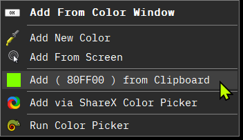
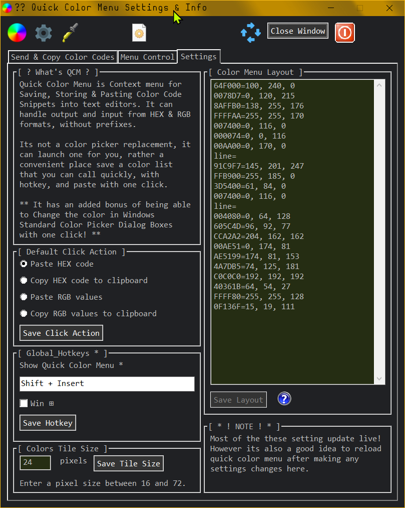
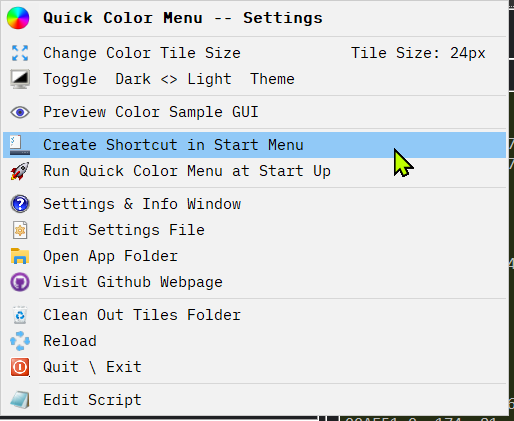
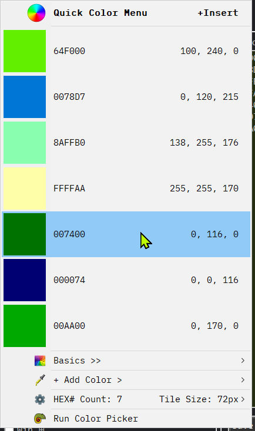
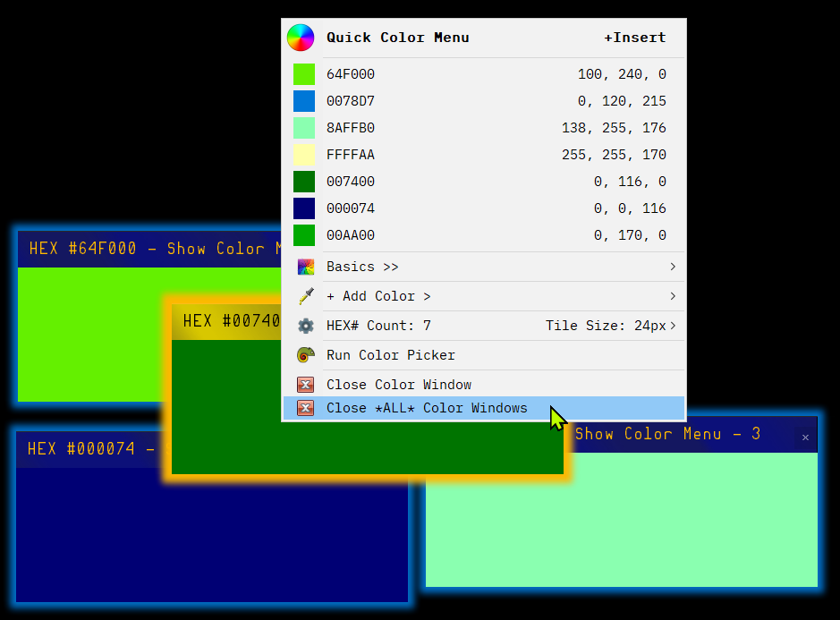

# What is Quick Color Menu?

A simple, lightweight, Context Menu for Quickly Storing and Pasting *HEX* and *RGB* Color Codes Snippets.

Made for any artists or designers who needs a keep a collection of your favorite color palettes nearby.

Leave it running in the background so it can be launched with a **customizable hotkey**, when clicking a menu item you can have one of four default actions carried out...

1. Paste a HEX code

2. Copy a HEX code to your clipboard

3. Paste a RGB code

4. Copy a RGB code to you clipboard

5. ** **It has an added bonus of being able to Change (and save from) the colors in Windows Standard Color Picker Dialog Boxes with one click!** 

***

# Adding colors to QCM

There is a dynamic sub-menu, `+ Add Color` on main menu.
1. **Add Color** opens an input box that accepts HEX & REB color codes without prefixes.
    - If your clipboard has a color code it when clicking this item it will skip the input box and add it automatically.
2. **Add From Screen** will follow you mouse and add a color after you click.

The next 3 items appear dynamically 

3. **Add From Clipboard**, if a HEX or RGB is in your clipboard this item appears, one click will add it.
3. If a **Add Color Picker Window** is active this menu item appears and it reads and adds the color via the RGB values.
4. **Add via ShareX**
    - If [ShareX](https://getsharex.com) is installed the menu can run ShareX's color picker, after clicking with ShareX it puts the color code in your clipboard which QCM will copy it into the menu.
5. **Run Color Picker**, Paste the path to your favorite Color picker app in the settings files and this menu item will appear allowing you launch it from them menu.
	- There are sssooooo many of these, I prefer the simplicity of [Just Color Picker](https://annystudio.com/software/colorpicker/). It's  freeware & QCM can read the color its displaying.

    - ShareX and the Color Picker items hide themselves unless the apps paths are set in the settings file.

# Removing Colors from QCM

To remove one color at a time there a hotkey you can use when the menu is open.

Hold down `Shift` + `Windows Key` and `Click` on a menu item to remove it.

Alternatively you can use the Menu Layout Panel in the  Settings Window ***OR*** Directly edit the `[ColorMenuLayout]` section in the -SETTINGS.ini file for quicker 

***

# Settings & Options

**There's a settings GUI and a Quick Settings Menu attached to the menu where you can customize a handful of options to you liking.**

## In the Settings Window you can...

1. Set the default click action
2. Set you own hotkey to open the menu.
3. Change the Color Tile Size
4. Arrange the Color Layout on the menu.

*The other tabs have some useful reminder information.*

## On the Quick Settings Menu you can... 

1. Toggle between light and dark mode
2. Start show Color Sample GUIs
3. Change the Color Tile Size 
    - The menu can show color tiles between 16 and 72 pixels.
4. Clean Out the `/Color Menu Tiles` Folder
    - The menu makes sample color tiles in `.png` format.  When you remove colors from the menu the tiles remain in the folder. If you start getting blank for wrong colored tiles on the menu, cleaning out unused color samples can fix it. the folder will be deleted and only the current menu colors will be remade.
5. Create a Start Menu link
6. Set QCM to Run at Start Up.
    - Makes a shortcut in `%appdata%\Microsoft\Windows\Start Menu\Programs\Startup`
7. plus, basics e.g. open settings window, reload & exit app, webpage link, open app folder and edit settings.ini

> All of these settings are save into the the `Quick Color Menu -SETTINGS.ini` file which you an also edit directly.

### Tile Size @ 72px

***

# Interacting with Color Picker Windows **

> **Quick Color Menu has a couple more tricks**

## **When a Standard Windows Color Picker Window is active  QCM will see it and change its behavior!**

1. Clicking a color on QCE will change the color window by sending the RGB Values to the window.

1. QCM can also save the current color the Picker Window is displaying from the `+ Add Color` Sub-menu

A Dynamic menu items appears at the top of them menu so you know that clicking will change the Color Pickers Values

***

# Color Sample GUIs

QCM can also create *Always On Top Color Sample GUIs* that you can drag around your screen if you need a visual color reference.

There are few ways to initiate a Color Sample GUI

1. Hold down `Ctrl` + `Shift` + `Win` + `Click` on a menu item will drop color down to you mouse.
2. Pick the *Preview Color Sample GUI* from the Settings Menu, the menu will reopen, choose your color.
3. Right clicking on a Color Sample GUI will show them menu, when clicking, a new GUIs will be generated automatically.

